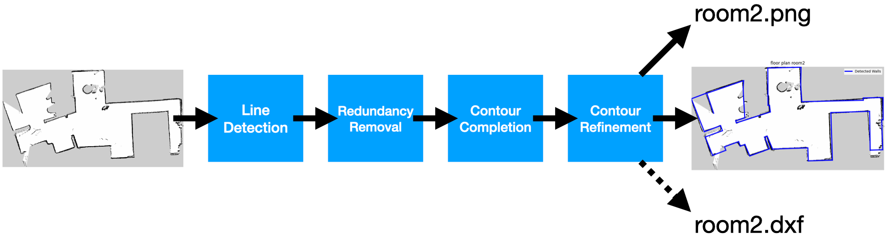

# SLAM Line Structure Extraction using OpenCV and NumPy

This document describes my approach for extracting and refining line structures from SLAM-generated occupancy grid maps using OpenCV and NumPy.



## Detailed Steps

### Step 1 (Optional): Contour Extraction and Dilation

This step is necessary only for maps that lack clear line structures.

- Extract contours from the original binary image.
- Dilate contours slightly to simplify subsequent line detection:

```python
kernel = np.ones((self.kernel_size, self.kernel_size), np.uint8)
binary = cv2.dilate(binary, kernel, iterations=self.dilate_iteration)
```

**Important:** Avoid excessive dilation to prevent redundant lines in the next step.

---

### Step 2: Noise Filtering and Line Detection (Hough Transform)

Before line detection, small noisy regions are removed to enhance accuracy:

```python
num_labels, labels, stats, _ = cv2.connectedComponentsWithStats(binary, connectivity=8) 
for i in range(1, num_labels): 
    if stats[i, cv2.CC_STAT_AREA] < self.min_area: 
        binary[labels == i] = 0
```
This ensures that only significant connected regions remain, reducing false detections.

**Hough Line Detection:**
```python
lines = cv2.HoughLinesP(binary, 1, np.pi / 180, threshold=self.Hough_thresh, minLineLength=self.Hough_minLength, maxLineGap=self.Hough_maxGap)
```

- `threshold`: Minimum number of votes (intersections in Hough space) needed for line detection. Higher values reduce false positives.
- `minLineLength`: Minimum length of a line to be accepted. Shorter segments are ignored, ensuring structural relevance.
- `maxLineGap`: Maximum gap allowed between segments to consider them as one continuous line. In our use case is typically set small to preserve structural coherence.

---

### Step 3: Redundant Line Removal

Redundant lines are identified and removed based on two criteria simultaneously:

- Angle similarity (nearly parallel lines)
- Spatial proximity (distance offset between lines)

Additionally, lines shorter than a certain threshold are removed as they contribute little to a clean structural completion step.

---

### Step 4: Contour Completion (Line Endpoint Pairing)

In this step, line endpoints are paired to complete the floor plan structures based on geometric relationships:

- **Parallel or nearly parallel lines**
- **Perpendicular or nearly perpendicular lines**
- **Default case (angles neither ~0° nor ~90°)**

Parallel lines are further differentiated into:

- **Collinear lines** (lines nearly aligned)
- **Distant parallel lines**

Lines are adjusted to be exactly parallel, perpendicular, or collinear.

> **Note:** Normalize angles to remain between -90° and 90° to accurately classify and adjust line pairs.

---

### Step 5: Refinement and Connectivity Enforcement

This step finalizes the floor plan by removing unpaired line segments, which:

- Are typically relatively short compared to paired segments
- Have at least one endpoint significantly distant from all neighboring endpoints

Removing these isolated segments ensures cleaner, more coherent floor plan structures.

Furthermore, point connectivity is verified to ensure that every endpoint is shared with at least one other line segment.

---

### Step 6 (Optional): Y-Axis Flipping for Vector Images

If vector images are required (e.g., DXF format), the y-axis must be inverted to match standard vector graphics coordinate systems that differs from OpenCV and Matplotlib

---

### Code Structure

<pre> slam_challenge_xiaoang/ 
        ├── assets/ 
        ├── config/  
        │     ├── config_room1.py  
        │     └── ... 
        ├── module/ # High-level processing modules 
        │     ├── contour_completion.py 
        │     └── contour_refinement.py 
        ├── utils/ # Low-level geometry utilities
        │     ├── check_extension_intersect.py 
        │     ├── check_perpendicular_intersect.py 
        │     └── ... 
        ├── floor_layout.py # Main script to run the floor plan extraction pipeline 
        └── README.md </pre>

### Environment Settings

```bash
git clone https://github.com/Xiaoang0211/slam_challenge_xiaoang.git
cd slam_challenge_xiaoang

# Create and activate conda environment
conda create -n slam_challenge python=3.11.10
conda activate slam_challenge

# Install dependencies
pip install -r requirements.txt
```

### How to Run the Code

For the configuration, use the room-specific `.yaml` files in the `config/` directory.

For the output, use the `assets/` directory and specify the room name as the output file name (shown in example).

```bash
python floor_layout.py -m <your_pgm_map_path> \
                        -c <path_to_the_room_specific_config_file> \
                        -o <output_path>
```

Example:

```bash
python floor_layout.py -m /home/xiaoang/Downloads/Python_post_proc_slam/room2.pgm \
                        -c /home/xiaoang/slam_challenge_xiaoang/config/config_room2.yaml \
                        -o /home/xiaoang/slam_challenge_xiaoang/assets/room2
```

### Configuration Options

In the config file, you can specify:

- The supported **image formats** for saving outputs are:  
    raster formats: `.png`, `.jpg`, `.jpeg`  
    vector format: `.dxf`

- Whether or not to **store a vector image** (`output_vector_image: true/false`)